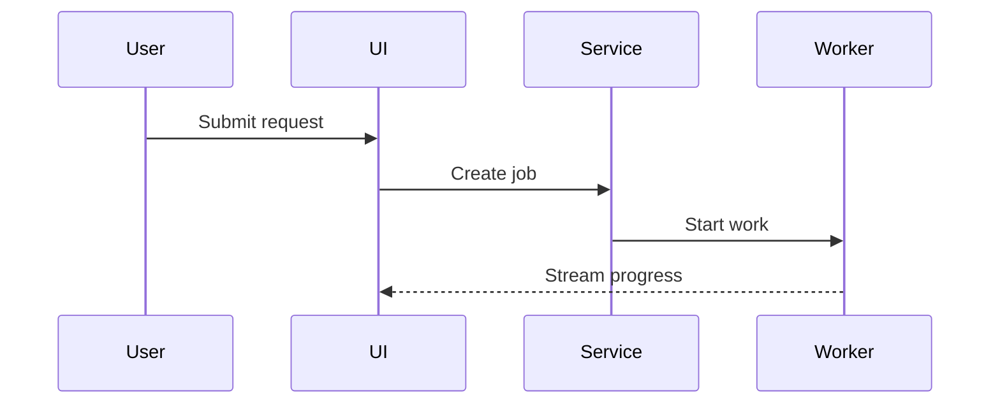

# Show Me

Choose the smallest visual that answers the user's question. Put the visual next to brief explanatory prose.

## Choose a format

- Use an indented text diagram or pseudocode for steps, logic, and simple hierarchy.
- Use a call tree for function calls, request paths, and runtime control flow.
- Use a file tree for module ownership, repository layout, and refactor scope.
- Use a component tree for UI structure, state, and important module boundaries.
- Use a Markdown table for exact comparisons, mappings, and compact inventories.
- Use a unified diff for before-and-after changes. Include only relevant context.
- Use Mermaid for service interaction, event flow, state transitions, or data flow.
- Use one focused HTML file only when text, tables, or Mermaid cannot show a dense visual clearly.

## Visual rules

- Show only the calls, files, states, props, and boundaries that answer the question.
- Use real names and paths when the source is known. Mark inferred details as assumptions.
- Keep diagrams shallow. Split a large view into focused views instead of shrinking it.
- Keep visuals copyable unless the user asks for a rendered artifact.
- Use standard Markdown code fences with a language tag when one exists.
- Keep prose brief. Explain what the visual shows and why it matters.
- Do not invent relationships, sequence, ownership, or system behavior.

## Examples

### Request flow



### Change shape

```diff
 submitForm
   createSession
     persistPrompt
+    expandSkillMention
     launchAgent
   navigateToSession
+  subscribeToEvents
```

### Ownership

```text
src/
├── commands/       # parses user actions
├── sessions/       # owns session state
└── transport/      # sends API requests
```

### Exact comparison

| Concern | Before | After |
|---|---|---|
| Request state | In memory | Persisted |
| Progress | Polled | Streamed |

## HTML artifacts

Create a focused HTML file only for a visual UI, layout, infographic, slide, or state comparison that needs rendering.

- Use real labels and data from the task.
- Support desktop and mobile layouts.
- Match the product's existing colors, type, spacing, and components when known.
- Tell the user the file path and open it when the environment supports that action.
